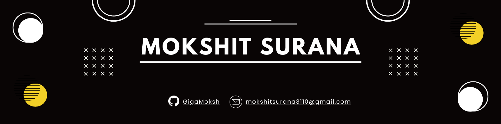

  

Hey there,

I'm Mokshit Surana, a Machine Learning Developer based in Mumbai IN, who is passionate about building machine learning user-friendly, easy-to-use applications, that makes a difference to the lives of those around me. I like to explore new trends and learn new technologies. I'm currently learning CSS and Javascript, and looking to collaborate on Open-Source projects, with a goal to be more involved in the Community. I'm also a fan of sci-fi tv shows/movies.

<!-- Want to know more about me? [Check out my portfolio](https://www.abdulfarhan.com) -->

## Current Stack

| Preprocessor Scripting Lang | Programming Lang |
| :--- | ---: |
|  | 
| **Frameworks, Platforms and Libraries** | **Databases** |
|        |   |
| **Hosting** | **Design**|
|     |  |

## Current Stats

 |    |
 | :---: |

 |  |  |
 | :---: | :---: |

 |  |
 | :---: |
